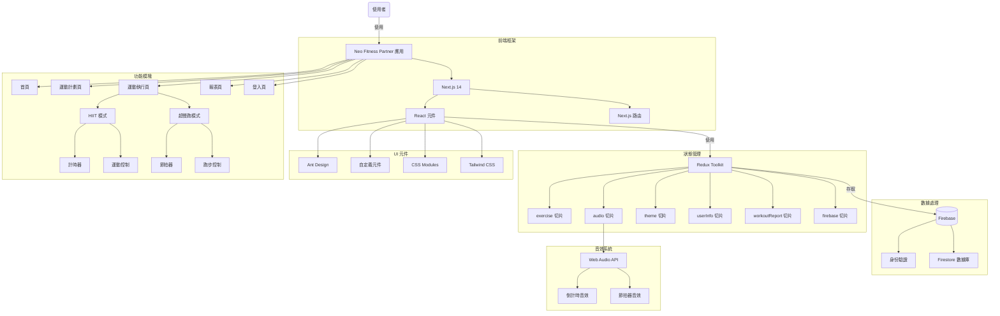
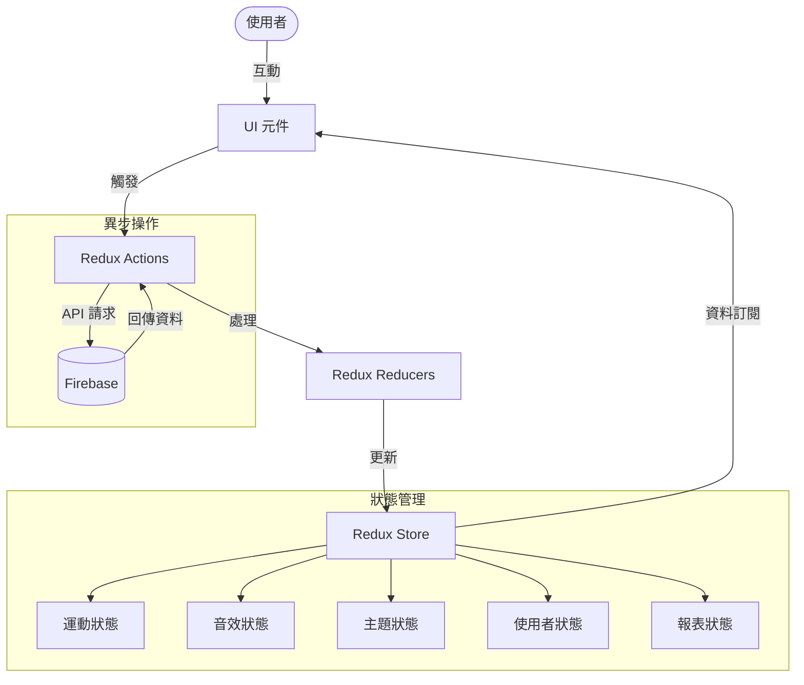
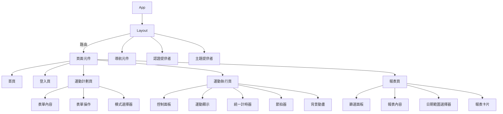
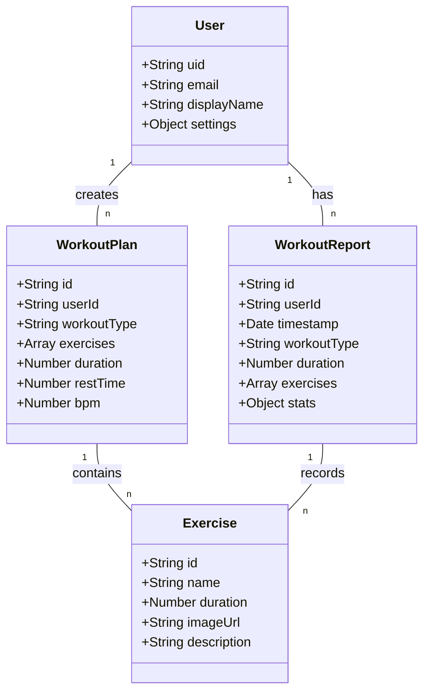

# Neo - Fitness Partner

## 目錄

- [APP 介紹與功能](#app-介紹與功能)
  - [主要功能](#主要功能)
  - [使用流程](#使用流程)
  - [畫面介紹](#畫面介紹)
- [技術選型與架構](#技術選型與架構)
  - [前端技術](#前端技術)
  - [資料流架構](#資料流架構)
  - [儲存方案](#儲存方案)
  - [第三方服務整合](#第三方服務整合)
  - [架構圖](#架構圖)
    - [應用架構總覽](#應用架構總覽)
    - [資料流架構圖](#資料流架構圖)
    - [元件結構圖](#元件結構圖)
    - [數據模型圖](#數據模型圖)

---

## APP 介紹與功能

Neo Fitness Partner 是一款專注於健身和跑步訓練的 Web 應用程式，提供高度客製化的運動體驗。無論您是健身愛好者還是跑步玩家，都能透過簡單的設定，享受到專業級的訓練指導和記錄功能。

### 主要功能

#### 1. HIIT 高強度間歇訓練

- 提供豐富的運動項目選擇（如登山者、深蹲等）
- 可自定義每組運動時長
- 自定義組間休息時間
- 多組訓練自動切換
- 運動計時器與提示音

#### 2. 超慢跑模式

- 可調整步頻 (BPM)
- 智能節拍器輔助
- 不限制時間的自由訓練模式
- 實時累計運動時間

#### 3. 運動報表

- 詳細的運動歷史記錄
- 不同時間維度的數據分析（日、週、月、年）
- 可視化圖表展示訓練進度
- 支持日期範圍篩選

### 使用流程

1. **計劃設定**：
   

   - 在 `create-workout-plan` 頁面選擇運動類型
   - 根據選擇的類型進行詳細設定：
     - HIIT 模式：選擇運動項目、設定運動時間和休息時間
     - 超慢跑模式：設定步頻 (BPM)

2. **運動執行**：

   - HIIT 模式：
     - 顯示當前運動項目和倒計時
     - 提供暫停、跳過、靜音、完成等控制功能
     - 組間自動切換休息與訓練
   - 超慢跑模式：
     - 顯示節拍器和累計時間
     - 提供暫停、節拍器開關、完成等控制功能

#### 3. 運動報表

3. **成果檢視**：
   - 運動完成後數據自動記錄
   - 在報表頁面查看歷史訓練數據與分析

### 畫面介紹

1. **首頁**：介紹應用功能，提供快速入口
2. **運動計劃頁**：設置訓練參數的界面
3. **運動執行頁**：根據不同模式顯示對應的訓練界面
4. **報表頁**：展示歷史數據和分析圖表

---

## 技術選型與架構

### 前端技術

- **框架**：Next.js 14 (React)
- **UI 庫**：Ant Design + 客製化樣式
- **狀態管理**：Redux Toolkit
- **樣式方案**：
  - CSS Modules
  - Tailwind CSS
  - Inline Styles
- **動畫效果**：
  - React Spring
  - CSS 動畫
- **音效處理**：Web Audio API

### 資料流架構

#### Redux 資料流

- **Store 設計**：
  - `exercise`: 運動狀態、計時器、運動列表
  - `audio`: 音效控制和狀態
  - `theme`: 主題設定 (亮色/暗色)
  - `userInfo`: 使用者資訊和設定
  - `workoutReport`: 運動報告與統計數據

#### 資料流程

1. **用戶操作** → 觸發 Action
2. **Reducer** → 更新 State
3. **Selector** → 組件訂閱並獲取資料
4. **UI 渲染** → 反映最新狀態

### 儲存方案

- **身份驗證**：Firebase Authentication
- **數據庫**：Firebase Firestore
  - 用戶資料
  - 運動記錄
  - 訓練報告

### 第三方服務整合

- **Firebase**：身份驗證、數據儲存
- **Chart.js**：數據視覺化
- **Web Audio API**：節拍器和提示音效

### 架構圖

以下架構圖展示了 Neo Fitness Partner 應用的整體結構、資料流、元件層次和數據模型。

#### 應用架構總覽

下圖展示了整個應用的架構，包括前端框架、狀態管理、數據處理和功能模塊之間的關係。

#### 資料流架構圖

此圖展示了應用中資料的流動方式，從用戶交互到 Redux actions、reducers、store 及與 Firebase 的交互。

#### 元件結構圖

此圖展示了應用的元件層次結構，從頂層的 App 元件到各個頁面及其子元件。

#### 數據模型圖

此圖展示了主要數據實體及其之間的關係。

