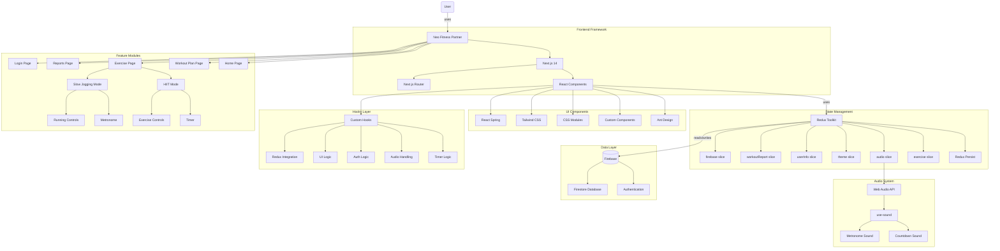
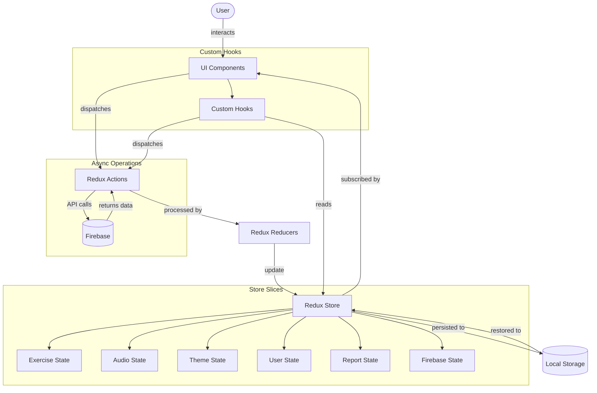
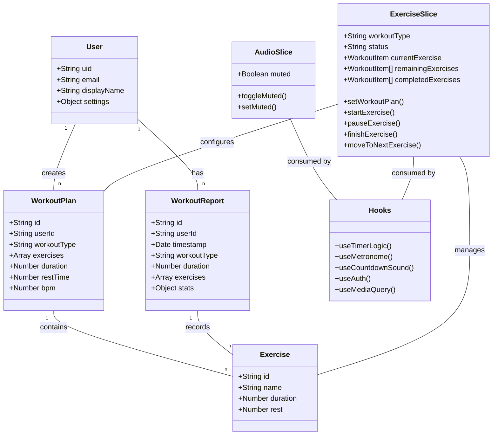

# Neo — Fitness Partner


[](https://nextjs.org/)
[](https://react.dev/)
[](https://redux-toolkit.js.org/)
[](https://firebase.google.com/)
[](https://www.typescriptlang.org/)

**Languages:** English | [繁體中文](./README.zh.md)

---

## Table of Contents

- [Overview](#overview)
- [Features](#features)
- [User Flow](#user-flow)
- [Getting Started](#getting-started)
- [Tech Stack & Architecture](#tech-stack--architecture)
  - [Frontend](#frontend)
  - [UI System & Design Tokens](#ui-system--design-tokens)
  - [Project Structure](#project-structure)
  - [State Management](#state-management)
  - [Custom Hooks](#custom-hooks)
  - [Styling Architecture](#styling-architecture)
  - [Storage & Third-party Services](#storage--third-party-services)
- [Architecture Diagrams](#architecture-diagrams)

---

## Overview

**Neo Fitness Partner** is a web application focused on fitness and running training, delivering a highly customisable workout experience. Whether you are a gym enthusiast or a casual runner, a few simple settings are all you need to access professional-grade training guidance and session tracking.

---

## Features

### 1. HIIT — High-Intensity Interval Training


- Rich selection of exercises (Mountain Climbers, Squats, and more)
- Customisable work duration per set
- Customisable rest duration between sets
- Automatic transition across multiple sets
- Built-in exercise timer with audio cues

### 2. Slow Jogging Mode


- Adjustable cadence (BPM)
- Intelligent metronome assistance
- Unlimited free-run mode
- Real-time cumulative workout timer

### 3. Workout Reports

- Detailed workout history
- Multi-dimension data analysis (daily, weekly, monthly, yearly)
- Visual charts to track training progress
- Date-range filtering

---

## User Flow

1. **Plan Setup**

   

   - Visit the `create-workout-plan` page and choose a workout type.
   - Configure details based on the selected type:
     - **HIIT**: Select exercises, set work time and rest time.
     - **Slow Jogging**: Set cadence (BPM).

2. **Workout Execution**

   - **HIIT mode**: Displays the current exercise with a countdown. Controls include pause, skip, mute, and finish. Sets cycle automatically.
   - **Slow Jogging mode**: Displays the metronome and elapsed time. Controls include pause, metronome toggle, and finish.

3. **Results Review**

   

   - Data is recorded automatically when a session ends.
   - View historical training data and analysis on the Reports page.

### Pages at a Glance

| Page | Purpose |
|---|---|
| Home | App introduction and quick-start entry |
| Workout Plan | Configure training parameters |
| Exercise | Real-time training interface (HIIT / Slow Jog) |
| Reports | Historical data and analytics charts |

---

## Getting Started

### Prerequisites

- Node.js ≥ 18
- A Firebase project (Authentication + Firestore enabled)

### Installation

```bash
# Clone the repository
git clone <repo-url>
cd FitnessPartner

# Install dependencies
npm install
```

### Environment Variables

Create a `.env.local` file at the project root and fill in your Firebase credentials:

```env
NEXT_PUBLIC_FIREBASE_API_KEY=
NEXT_PUBLIC_FIREBASE_AUTH_DOMAIN=
NEXT_PUBLIC_FIREBASE_PROJECT_ID=
NEXT_PUBLIC_FIREBASE_STORAGE_BUCKET=
NEXT_PUBLIC_FIREBASE_MESSAGING_SENDER_ID=
NEXT_PUBLIC_FIREBASE_APP_ID=
```

### Development

```bash
npm run dev       # Start development server (http://localhost:3000)
npm run build     # Production build
npm run start     # Start production server
npm run lint      # Run ESLint
```

---

## Tech Stack & Architecture

### Frontend

| Category | Technology |
|---|---|
| Framework | Next.js 14 (App Router) |
| UI Library | Ant Design + custom styles |
| State Management | Redux Toolkit + Redux Persist |
| Styling | CSS Modules (primary), Tailwind CSS (utility), Ant Design theme |
| Animation | React Spring (background), CSS animations (transitions) |
| Audio | Web Audio API + use-sound |

### UI System & Design Tokens

Neo uses a complete design system to ensure visual consistency and accessibility.

#### Design Tokens

| Token | Description |
|---|---|
| Color | 50–900 scale, automatic dark/light theme switching |
| Typography | Full size scale from `xs` to `9xl` |
| Spacing | Unified spacing based on a 4 px grid |
| Shadow | 4-level depth system |
| Border Radius | 4 graduated radius values |

#### Responsive Design

- **Breakpoints**: Mobile (639 px), Tablet (1023 px), Desktop
- **Mobile-first**: Designs start at the smallest viewport
- **Adaptive navigation**: Hamburger menu on mobile, horizontal nav on desktop

#### Accessibility (A11y)

- ✅ WCAG AA colour contrast
- ✅ Keyboard navigation (Tab, Enter, Escape)
- ✅ ARIA labels and semantic HTML
- ✅ Visible focus indicators
- ✅ Image `alt` text and icon `aria-label`

#### Theme System

- Dark mode (default) and light mode
- Smooth theme-switch animation (View Transition API)
- Automatic detection of system preference
- Persistent user preference via Redux Persist

#### Shared UI Components

| Component | Purpose |
|---|---|
| `Skeleton` | 6 loading placeholder variants |
| `Spinner` | Inline and full-screen loading indicators |
| `EmptyState` | No-data feedback |
| `ErrorState` | Error handling with recovery suggestions |

#### Related Docs

- 📚 [Design System Guide](./docs/design-system.md)
- 📚 [Component Library](./docs/component-library.md)
- 📚 [CSS Strategy](./docs/css-strategy.md)
- 📚 [Performance Guide](./docs/performance-guide.md)

### Project Structure

#### Application Layer

```
/app                        # Next.js App Router root
  /components               # Shared components
  /[feature]                # Feature pages (e.g. exercise, create-workout-plan)
    /page.tsx               # Page entry point
    /components             # Feature-scoped components
      /[ComponentName]
        /index.tsx          # Component source
        /styles.module.css  # Component styles
        /const.ts           # Component constants
  /interface                # TypeScript interface definitions
  /static                   # Static assets

/lib                        # Logic layer & shared utilities
  /features                 # Redux slices
  /hooks                    # Custom hooks
  /utils                    # Utility functions
```

#### Component Convention

Every component follows the same structure:

```
/ComponentName
  /index.tsx           # Main component file
  /styles.module.css   # Scoped styles
  /const.ts            # Constants (if needed)
  /components          # Sub-components (if needed)
```

### State Management

#### Redux Store Slices

| Slice | Responsibility |
|---|---|
| `exercise` | Workout status, timer, type, and exercise list |
| `audio` | Audio control and mute state |
| `theme` | Light / dark mode preference |
| `userInfo` | User info, settings, and UI state |
| `firebase` | Firebase connection status |
| `workoutReport` | Workout reports and statistics |

#### Persistence Strategy

Critical state is persisted via Redux Persist:

```typescript
const exercisePersistConfig = {
  key: "exercise",
  storage,
  whitelist: ["currentExercise", "remainingExercises", "workoutType"],
};
```

#### Data Flow

```
User Interaction → Action dispatched → Reducer updates State
    ↑                                         |
    └──────── UI re-renders ←─── Selectors ───┘
                                      |
                               Firebase / LocalStorage
```

### Custom Hooks

#### Hook Categories

| Category | Hook | Purpose |
|---|---|---|
| Timer | `useTimerLogic` | Core countdown & next-exercise logic |
| Audio | `useMetronome` | Metronome beat control |
| Audio | `useCountdownSound` | Countdown audio cues |
| UI | `useMediaQuery` | Responsive breakpoint detection |
| Redux | `useAppDispatch` / `useAppSelector` | Type-safe Redux bindings |
| Auth | `useAuth` | Firebase authentication integration |

#### Design Principles

- **Single Responsibility** — each hook solves one specific problem
- **Reusability** — logic is shared across components
- **Separation of Concerns** — UI logic is decoupled from business logic
- **Type Safety** — full TypeScript coverage

### Styling Architecture

1. **CSS Modules** — component-specific styles are scoped in `.module.css` files
2. **Global Variables** — colours, spacing, and typography defined as CSS custom properties in `globals.css`
3. **Ant Design Theme** — centralised via `ConfigProvider`; component-specific overrides via CSS Modules

### Storage & Third-party Services

| Service | Usage |
|---|---|
| Firebase Authentication | User sign-in / sign-up |
| Firebase Firestore | User data, workout records, training reports |
| Chart.js | Data visualisation in reports |
| Web Audio API | Metronome beats and audio cues |

---

## Architecture Diagrams

The diagrams below illustrate the overall structure, data flow, component hierarchy, and data model of Neo Fitness Partner.

### Application Architecture Overview



### Data Flow



### Component Hierarchy

```mermaid
graph TD
    App[App] --> Layout[Layout]
    App --> StoreProvider[StoreProvider]
    Layout --> |routes| Pages[Page Components]
    Layout --> Navigation[Navigation]
    Layout --> AuthProvider[AuthProvider]
    Layout --> ThemeProvider[ThemeProvider]

    subgraph "Pages"
        Pages --> HomePage[Home Page]
        Pages --> LoginPage[Login Page]
        Pages --> WorkoutPlanPage[Workout Plan Page]
        Pages --> ExercisePage[Exercise Page]
        Pages --> ReportPage[Reports Page]
    end

    subgraph "Component File Structure"
        Component[Component] --> IndexFile["index.tsx (main)"]
        Component --> StyleFile["styles.module.css (styles)"]
        Component --> ConstFile["const.ts (constants)"]
        Component --> SubComponents["components/ (sub-components)"]
    end

    subgraph "Feature Page Components"
        WorkoutPlanPage --> FormContent[FormContent]
        WorkoutPlanPage --> FormAction[FormAction]
        WorkoutPlanPage --> SimpleModeSelector[SimpleModeSelector]
        WorkoutPlanPage --> PlanForm[PlanForm]
        WorkoutPlanPage --> PopularSet[PopularSet]

        ExercisePage --> ControlPanel[ControlPanel]
        ExercisePage --> Exercise[Exercise]
        ExercisePage --> UnifiedTimer[UnifiedTimer]
        ExercisePage --> Metronome[Metronome]
        ExercisePage --> ReactSpringBg[ReactSpringBg]
        ExercisePage --> TimerBg[TimerBg]
        ExercisePage --> WorkoutModeSelector[WorkoutModeSelector]
    end
```

### Data & Logic Model



