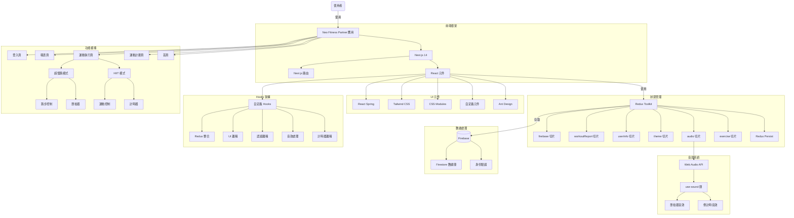
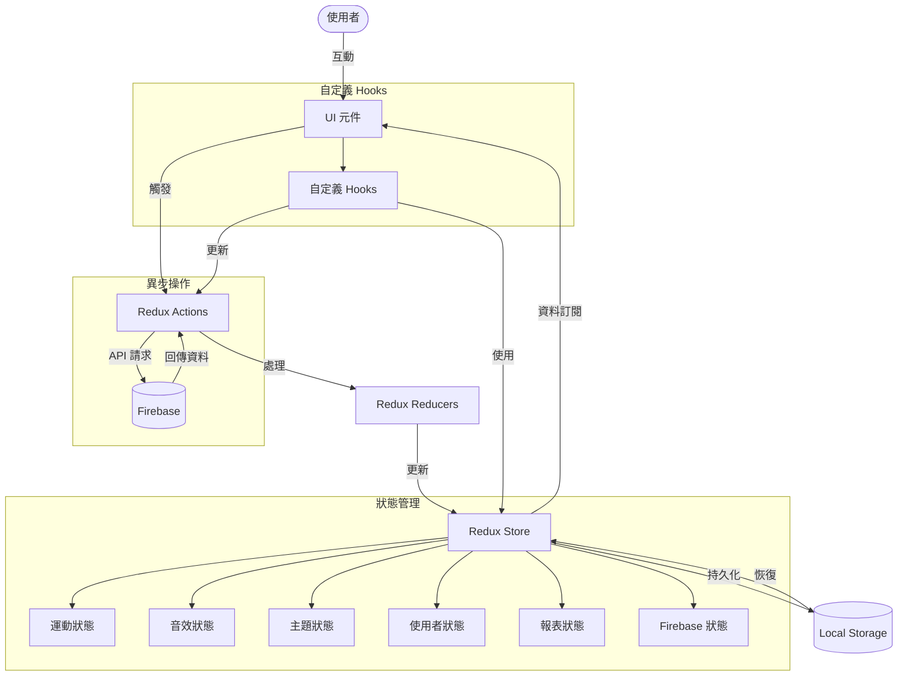
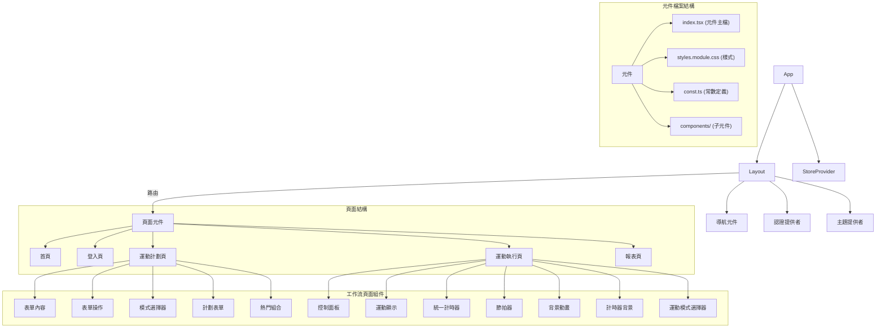
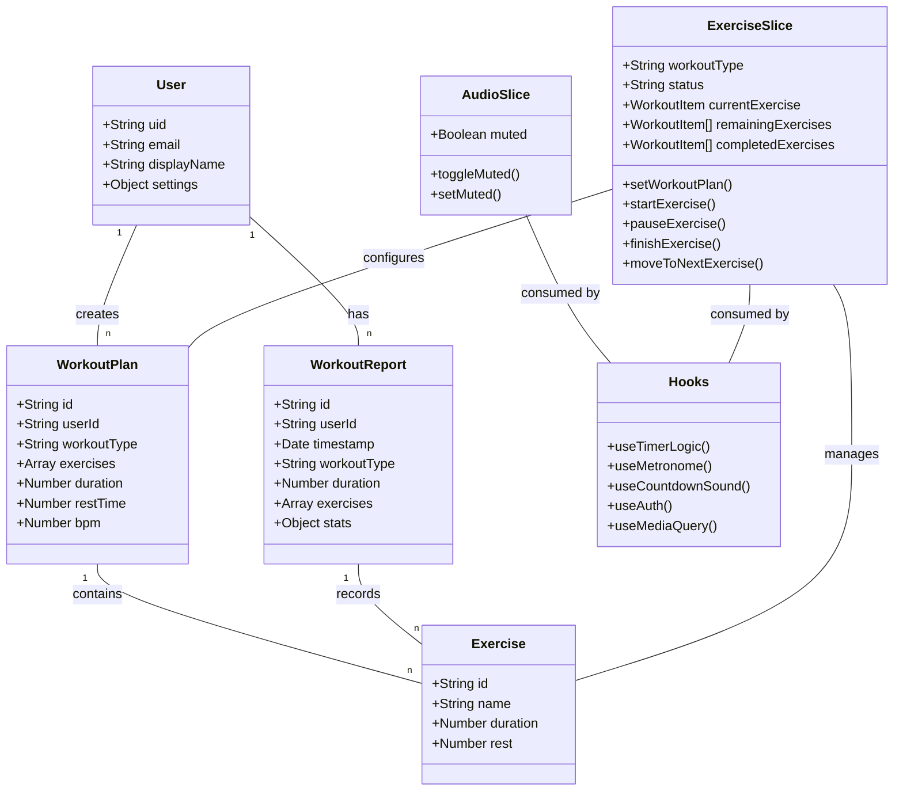

# Neo - Fitness Partner


## 目錄

- [APP 介紹與功能](#app-介紹與功能)
  - [主要功能](#主要功能)
  - [使用流程](#使用流程)
  - [畫面介紹](#畫面介紹)
- [技術選型與架構](#技術選型與架構)
  - [前端技術](#前端技術)
  - [資料流架構](#資料流架構)
  - [儲存方案](#儲存方案)
  - [第三方服務整合](#第三方服務整合)
  - [架構圖](#架構圖)
    - [應用架構總覽](#應用架構總覽)
    - [資料流架構圖](#資料流架構圖)
    - [元件結構圖](#元件結構圖)
    - [數據模型圖](#數據模型圖)

---

## APP 介紹與功能

Neo Fitness Partner 是一款專注於健身和跑步訓練的 Web 應用程式，提供高度客製化的運動體驗。無論您是健身愛好者還是跑步玩家，都能透過簡單的設定，享受到專業級的訓練指導和記錄功能。

### 主要功能

#### 1. HIIT 高強度間歇訓練


- 提供豐富的運動項目選擇（如登山者、深蹲等）
- 可自定義每組運動時長
- 自定義組間休息時間
- 多組訓練自動切換
- 運動計時器與提示音

#### 2. 超慢跑模式


- 可調整步頻 (BPM)
- 智能節拍器輔助
- 不限制時間的自由訓練模式
- 實時累計運動時間

#### 3. 運動報表

- 詳細的運動歷史記錄
- 不同時間維度的數據分析（日、週、月、年）
- 可視化圖表展示訓練進度
- 支持日期範圍篩選

### 使用流程

1. **計劃設定**：
   

   - 在 `create-workout-plan` 頁面選擇運動類型
   - 根據選擇的類型進行詳細設定：
     - HIIT 模式：選擇運動項目、設定運動時間和休息時間
     - 超慢跑模式：設定步頻 (BPM)

2. **運動執行**：

   - HIIT 模式：
     - 顯示當前運動項目和倒計時
     - 提供暫停、跳過、靜音、完成等控制功能
     - 組間自動切換休息與訓練
   - 超慢跑模式：
     - 顯示節拍器和累計時間
     - 提供暫停、節拍器開關、完成等控制功能

#### 3. 運動報表


3. **成果檢視**：
   - 運動完成後數據自動記錄
   - 在報表頁面查看歷史訓練數據與分析

### 畫面介紹

1. **首頁**：介紹應用功能，提供快速入口
2. **運動計劃頁**：設置訓練參數的界面
3. **運動執行頁**：根據不同模式顯示對應的訓練界面
4. **報表頁**：展示歷史數據和分析圖表

---

## 技術選型與架構

### 前端技術

- **框架**：Next.js 14 (React)
- **UI 庫**：Ant Design + 客製化樣式
- **狀態管理**：Redux Toolkit + Redux Persist
- **樣式方案**：
  - CSS Modules（主要）
  - Tailwind CSS（輔助）
  - Ant Design 主題系統
- **動畫效果**：
  - React Spring（背景動態效果）
  - CSS 動畫（介面過渡）
- **音效處理**：Web Audio API + use-sound

### 檔案分層架構

#### 1. 應用層結構

```
/app                    # Next.js 應用目錄
  /components           # 共用元件
  /[feature]            # 功能頁面（如 exercise, create-workout-plan）
    /page.tsx           # 頁面入口
    /components         # 功能專屬元件
      /[ComponentName]  # 獨立元件
        /index.tsx      # 元件主檔
        /styles.module.css # 元件樣式
        /const.ts       # 元件常數
  /interface            # TypeScript 介面定義
  /static               # 靜態資源

/lib                    # 邏輯層與共用功能
  /features             # Redux 功能模組（slices）
  /hooks                # 自定義 Hooks
  /utils                # 工具函數
```

#### 2. 元件結構標準

每個元件遵循一致的結構模式：

```
/ComponentName
  /index.tsx           # 元件主檔
  /styles.module.css   # 封裝的樣式
  /const.ts            # 元件相關常數（若需要）
  /components          # 子元件（若需要）
```

### 資料流架構

#### Redux 資料流設計

- **分層設計**：

  ```
  /lib/features/[domain]/[domain]Slice.ts  # Redux 切片
  /lib/store.ts                           # 全局 store 配置
  ```

- **Store 設計**：

  - `exercise`: 運動狀態、計時器、運動類型與列表管理
  - `audio`: 音效控制與靜音狀態
  - `theme`: 主題設定（亮色/暗色模式）
  - `userInfo`: 使用者資訊、設定與 UI 狀態
  - `firebase`: Firebase 連接狀態管理
  - `workoutReport`: 運動報告與統計數據

- **持久化策略**：
  使用 Redux-Persist 針對關鍵資料實現持久化：
  ```typescript
  const exercisePersistConfig = {
    key: "exercise",
    storage,
    whitelist: ["currentExercise", "remainingExercises", "workoutType"],
  };
  ```

#### 資料流程

1. **用戶操作** → 觸發 Action
2. **Reducer** → 更新 State
3. **Selectors** → 使用 TypeScript 類型安全選擇器獲取資料
4. **UI 渲染** → 反映最新狀態

### Hooks 架構與運用

#### 1. 自定義 Hooks 分類

- **狀態邏輯封裝**：

  - `/lib/hooks/timer/useTimerLogic.ts` - 計時器核心邏輯
  - `/lib/hooks/useMetronome.ts` - 節拍器功能

- **UI 功能封裝**：

  - `/lib/hooks/ui/useMediaQuery.ts` - 響應式設計支援

- **Redux 整合**：

  - `/lib/hooks/redux/useRedux.ts` - 類型安全的 Redux Hooks

  ```typescript
  export const useAppDispatch = useDispatch.withTypes<AppDispatch>();
  export const useAppSelector = useSelector.withTypes<RootState>();
  ```

- **音效處理**：

  - `/lib/hooks/audio/useCountdownSound.ts` - 倒數音效處理

- **身份驗證**：
  - `/lib/hooks/auth/useAuth.ts` - Firebase 認證整合

#### 2. Hooks 設計原則

- **單一職責**：每個 Hook 專注於解決特定問題
- **可重用性**：跨組件共享邏輯
- **關注點分離**：UI 邏輯與業務邏輯分離
- **類型安全**：完整的 TypeScript 類型支持

例如，計時器邏輯實現：

```typescript
/**
 * 運動計時邏輯的 Hook
 * 只專注於:計時邏輯(本地+Redux)以及切換下一個運動的時機邏輯
 * flow: 註冊timer => 每秒觸發計時邏輯 => 更新本地狀態 => 在關鍵節點更新Redux
 */
export const useTimerLogic = () => {
  // 邏輯實現...
};
```

### 常數定義方式

採用模組化的常數定義策略：

1. **功能模組常數**：

   - 每個功能模組的常數放在該模組下的 `const.ts` 中

   ```typescript
   // app/create-workout-plan/components/FormContent/const.ts
   export const workoutItems = [
     "登山者",
     "俯臥撐",
     "深蹲",
     // ...
   ];
   ```

2. **路由映射**：

   ```typescript
   // app/components/Navigation/const.ts
   export const routerMap = {
     Home: "/",
     "Workout Plan": "/create-workout-plan",
     // ...
   };
   ```

3. **樣式變數**：
   - 使用 CSS 自定義屬性在 `globals.css` 中定義全局變數
   ```css
   :root {
     --color-primary: #202020ff;
     --spacing-md: 1rem;
     /* ... */
   }
   ```

### 樣式架構

採用 CSS Modules 為主體的混合式架構：

1. **CSS Modules 核心原則**：

   - 元件特定樣式使用 `.module.css` 文件隔離
   - 響應式設計集成在 CSS Modules 中
   - 通過類名命名實現樣式範圍隔離

2. **全局變數系統**：

   - 在 `globals.css` 中定義顏色、間距、字體等全局變數
   - 在 CSS Modules 中引用全局變數，確保一致性

3. **Ant Design 主題整合**：
   - 通過 ConfigProvider 集中配置主題
   - 針對特定組件通過 CSS Modules 覆寫樣式

### 儲存方案

- **身份驗證**：Firebase Authentication
- **數據庫**：Firebase Firestore
  - 用戶資料
  - 運動記錄
  - 訓練報告

### 第三方服務整合

- **Firebase**：身份驗證、數據儲存
- **Chart.js**：數據視覺化
- **Web Audio API**：節拍器和提示音效

### 架構圖

以下架構圖展示了 Neo Fitness Partner 應用的整體結構、資料流、元件層次和數據模型。

#### 應用架構總覽

下圖展示了整個應用的架構，包括前端框架、狀態管理、數據處理和功能模塊之間的關係。



#### 資料流架構圖

此圖展示了應用中資料的流動方式，從用戶交互到 Redux actions、reducers、store 及與 Firebase 的交互。



#### 元件結構圖

此圖展示了應用的元件層次結構和檔案組織方式。



#### 數據與邏輯架構圖

此圖展示了主要數據實體及其與邏輯層的關係。


