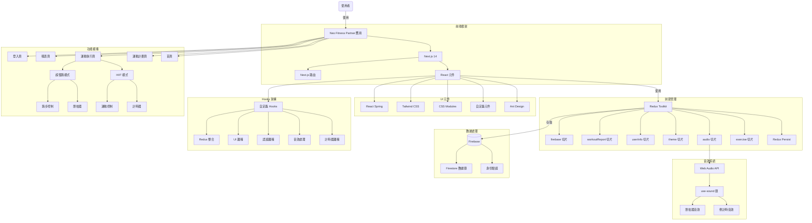
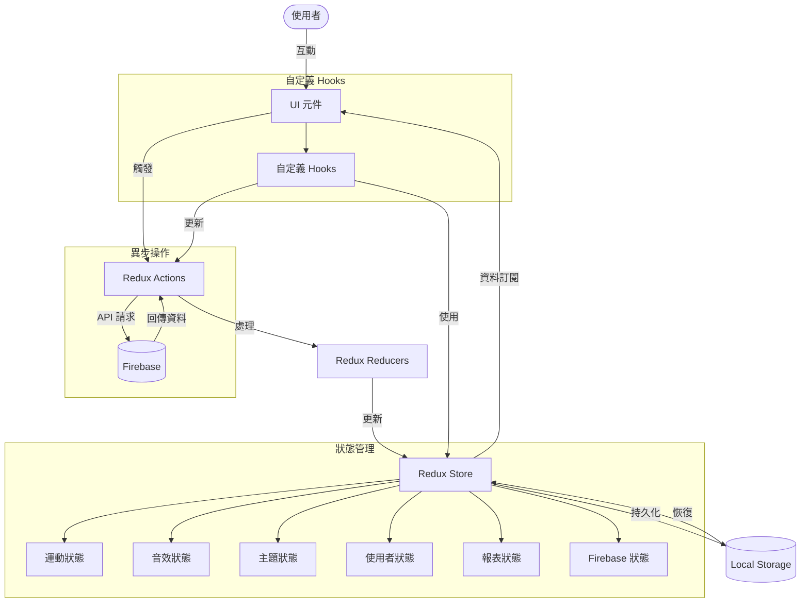
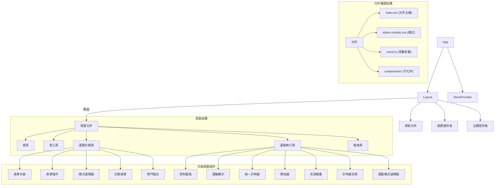
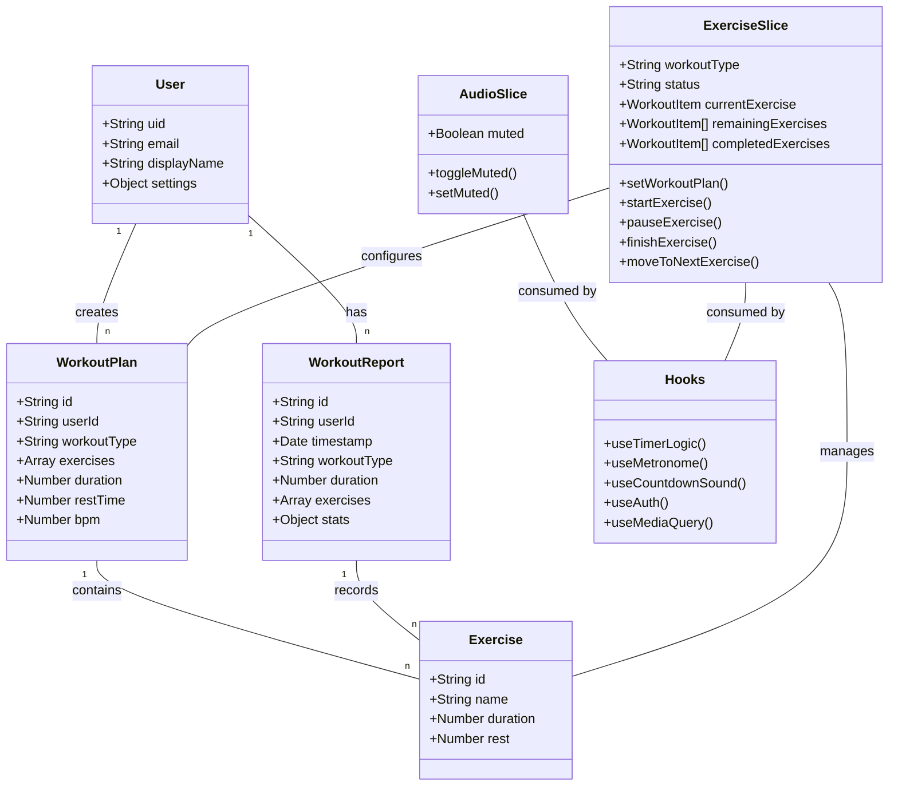

# Neo — Fitness Partner


[](https://nextjs.org/)
[](https://react.dev/)
[](https://redux-toolkit.js.org/)
[](https://firebase.google.com/)
[](https://www.typescriptlang.org/)

**語言：** [English](./README.md) | 繁體中文

---

## 目錄

- [專案簡介](#專案簡介)
- [主要功能](#主要功能)
- [使用流程](#使用流程)
- [快速開始](#快速開始)
- [技術選型與架構](#技術選型與架構)
  - [前端技術](#前端技術)
  - [UI 系統與設計制度](#ui-系統與設計制度)
  - [檔案分層架構](#檔案分層架構)
  - [狀態管理](#狀態管理)
  - [Hooks 架構](#hooks-架構)
  - [樣式架構](#樣式架構)
  - [儲存方案與第三方服務](#儲存方案與第三方服務)
- [架構圖](#架構圖)

---

## 專案簡介

**Neo Fitness Partner** 是一款專注於健身和跑步訓練的 Web 應用程式，提供高度客製化的運動體驗。無論您是健身愛好者還是跑步玩家，都能透過簡單的設定，享受到專業級的訓練指導和記錄功能。

---

## 主要功能

### 1. HIIT 高強度間歇訓練


- 提供豐富的運動項目選擇（如登山者、深蹲等）
- 可自定義每組運動時長
- 自定義組間休息時間
- 多組訓練自動切換
- 運動計時器與提示音

### 2. 超慢跑模式


- 可調整步頻 (BPM)
- 智能節拍器輔助
- 不限制時間的自由訓練模式
- 實時累計運動時間

### 3. 運動報表

- 詳細的運動歷史記錄
- 不同時間維度的數據分析（日、週、月、年）
- 可視化圖表展示訓練進度
- 支持日期範圍篩選

---

## 使用流程

1. **計劃設定**

   

   - 在 `create-workout-plan` 頁面選擇運動類型
   - 根據選擇的類型進行詳細設定：
     - **HIIT 模式**：選擇運動項目、設定運動時間和休息時間
     - **超慢跑模式**：設定步頻 (BPM)

2. **運動執行**

   - **HIIT 模式**：顯示當前運動項目和倒計時，提供暫停、跳過、靜音、完成等控制功能，組間自動切換休息與訓練
   - **超慢跑模式**：顯示節拍器和累計時間，提供暫停、節拍器開關、完成等控制功能

3. **成果檢視**

   

   - 運動完成後數據自動記錄
   - 在報表頁面查看歷史訓練數據與分析

### 畫面一覽

| 頁面 | 用途 |
|---|---|
| 首頁 | 介紹應用功能，提供快速入口 |
| 運動計劃頁 | 設置訓練參數的界面 |
| 運動執行頁 | 根據不同模式顯示對應的訓練界面 |
| 報表頁 | 展示歷史數據和分析圖表 |

---

## 快速開始

### 環境需求

- Node.js ≥ 18
- 一個 Firebase 專案（需啟用 Authentication 與 Firestore）

### 安裝

```bash
# Clone 專案
git clone <repo-url>
cd FitnessPartner

# 安裝相依套件
npm install
```

### 環境變數

在專案根目錄建立 `.env.local` 並填入 Firebase 設定：

```env
NEXT_PUBLIC_FIREBASE_API_KEY=
NEXT_PUBLIC_FIREBASE_AUTH_DOMAIN=
NEXT_PUBLIC_FIREBASE_PROJECT_ID=
NEXT_PUBLIC_FIREBASE_STORAGE_BUCKET=
NEXT_PUBLIC_FIREBASE_MESSAGING_SENDER_ID=
NEXT_PUBLIC_FIREBASE_APP_ID=
```

### 開發指令

```bash
npm run dev       # 啟動開發伺服器 (http://localhost:3000)
npm run build     # 生產環境建置
npm run start     # 啟動生產伺服器
npm run lint      # 執行 ESLint
```

---

## 技術選型與架構

### 前端技術

| 分類 | 技術 |
|---|---|
| 框架 | Next.js 14 (App Router) |
| UI 庫 | Ant Design + 客製化樣式 |
| 狀態管理 | Redux Toolkit + Redux Persist |
| 樣式方案 | CSS Modules（主要）、Tailwind CSS（輔助）、Ant Design 主題系統 |
| 動畫效果 | React Spring（背景動態效果）、CSS 動畫（介面過渡） |
| 音效處理 | Web Audio API + use-sound |

### UI 系統與設計制度

Neo 應用採用完整的設計系統，確保視覺一致性與無障礙性。

#### 設計 Tokens

| Token | 說明 |
|---|---|
| 色彩系統 | 50–900 分級色階，支援深色/淺色主題自動切換 |
| 排版系統 | 從 xs 到 9xl 的完整字號層級 |
| 間距系統 | 基於 4px 網格的統一間距 |
| 陰影系統 | 4 個等級的深度表現 |
| 圓角系統 | 4 個等級的圓角值 |

#### 響應式設計

- **斷點**：Mobile (639px)、Tablet (1023px)、Desktop
- **移動優先**：從行動設備開始設計
- **自適應導航**：手機漢堡選單 + 桌面橫向導航

#### 無障礙性 (A11y)

- ✅ WCAG AA 色彩對比度標準
- ✅ 鍵盤導航支援（Tab、Enter、Escape）
- ✅ ARIA labels 與語義化 HTML
- ✅ 焦點指示視覺反饋
- ✅ 圖片 alt text 與圖標 aria-label

#### 主題系統

- 深色模式（預設）與淺色模式
- 平滑主題切換動畫（View Transition API）
- 系統偏好自動檢測
- 用戶偏好持久化

#### 常用 UI 組件

| 組件 | 用途 |
|---|---|
| `Skeleton` | 6 種類型的加載占位符 |
| `Spinner` | 行內和全屏加載指示器 |
| `EmptyState` | 無資料狀態提示 |
| `ErrorState` | 錯誤處理與恢復建議 |

#### 相關文檔

- 📚 [設計系統指南](./docs/design-system.md)
- 📚 [組件庫文檔](./docs/component-library.md)
- 📚 [CSS 策略](./docs/css-strategy.md)
- 📚 [效能指南](./docs/performance-guide.md)

### 檔案分層架構

#### 應用層結構

```
/app                        # Next.js App Router 根目錄
  /components               # 共用元件
  /[feature]                # 功能頁面（如 exercise, create-workout-plan）
    /page.tsx               # 頁面入口
    /components             # 功能專屬元件
      /[ComponentName]
        /index.tsx          # 元件主檔
        /styles.module.css  # 元件樣式
        /const.ts           # 元件常數
  /interface                # TypeScript 介面定義
  /static                   # 靜態資源

/lib                        # 邏輯層與共用功能
  /features                 # Redux 功能模組（slices）
  /hooks                    # 自定義 Hooks
  /utils                    # 工具函數
```

#### 元件結構標準

每個元件遵循一致的結構模式：

```
/ComponentName
  /index.tsx           # 元件主檔
  /styles.module.css   # 封裝的樣式
  /const.ts            # 元件相關常數（若需要）
  /components          # 子元件（若需要）
```

### 狀態管理

#### Redux Store 切片

| Slice | 職責 |
|---|---|
| `exercise` | 運動狀態、計時器、運動類型與列表管理 |
| `audio` | 音效控制與靜音狀態 |
| `theme` | 主題設定（亮色/暗色模式） |
| `userInfo` | 使用者資訊、設定與 UI 狀態 |
| `firebase` | Firebase 連接狀態管理 |
| `workoutReport` | 運動報告與統計數據 |

#### 持久化策略

使用 Redux Persist 針對關鍵資料實現持久化：

```typescript
const exercisePersistConfig = {
  key: "exercise",
  storage,
  whitelist: ["currentExercise", "remainingExercises", "workoutType"],
};
```

#### 資料流程

```
用戶操作 → 觸發 Action → Reducer 更新 State
  ↑                                    |
  └──── UI 渲染 ←──── Selectors ────────┘
                             |
                     Firebase / LocalStorage
```

### Hooks 架構

#### 自定義 Hooks 分類

| 分類 | Hook | 用途 |
|---|---|---|
| 計時器 | `useTimerLogic` | 計時器核心邏輯與切換下一個運動的時機 |
| 音效 | `useMetronome` | 節拍器控制 |
| 音效 | `useCountdownSound` | 倒數音效處理 |
| UI | `useMediaQuery` | 響應式斷點偵測 |
| Redux | `useAppDispatch` / `useAppSelector` | 類型安全的 Redux Hooks |
| 認證 | `useAuth` | Firebase 認證整合 |

#### Hooks 設計原則

- **單一職責**：每個 Hook 專注於解決特定問題
- **可重用性**：跨組件共享邏輯
- **關注點分離**：UI 邏輯與業務邏輯分離
- **類型安全**：完整的 TypeScript 類型支持

### 樣式架構

1. **CSS Modules**：元件特定樣式使用 `.module.css` 文件隔離，通過類名命名實現樣式範圍隔離
2. **全局變數系統**：在 `globals.css` 中定義顏色、間距、字體等 CSS 自定義屬性
3. **Ant Design 主題整合**：通過 ConfigProvider 集中配置主題；特定組件通過 CSS Modules 覆寫樣式

### 儲存方案與第三方服務

| 服務 | 用途 |
|---|---|
| Firebase Authentication | 使用者登入／註冊 |
| Firebase Firestore | 用戶資料、運動記錄、訓練報告 |
| Chart.js | 報表數據視覺化 |
| Web Audio API | 節拍器和提示音效 |

---

## 架構圖

### 應用架構總覽



### 資料流架構圖



### 元件結構圖



### 數據與邏輯架構圖


